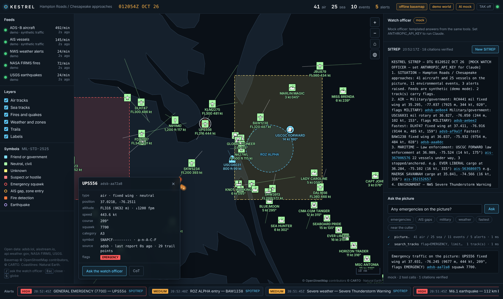
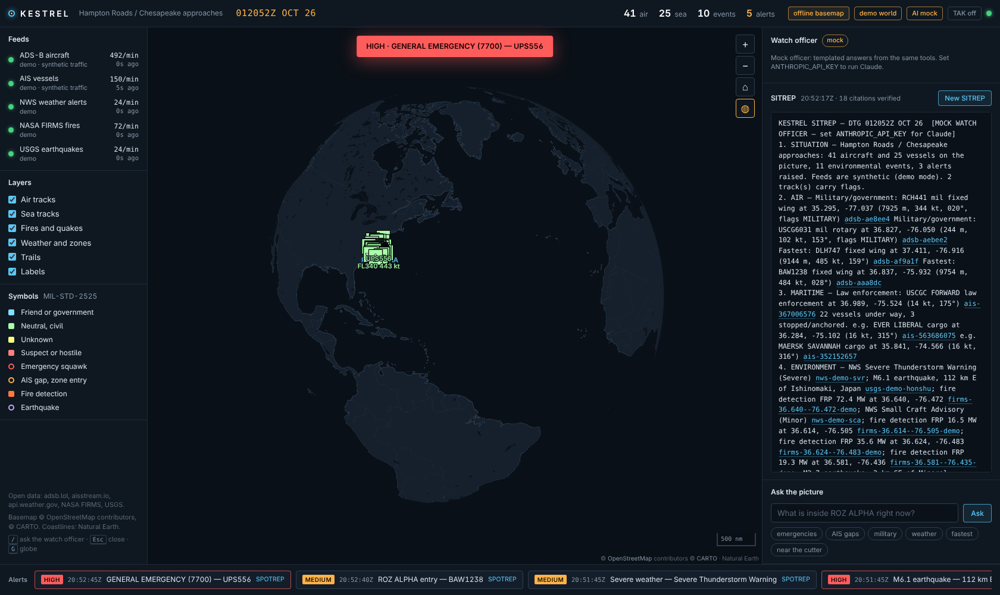

# Kestrel COP

An open-feeds **common operational picture** with an **AI watch officer**. Kestrel pulls live aircraft
(ADS-B), vessels (AIS), weather warnings (NWS), active fires (NASA FIRMS) and earthquakes (USGS) onto one
map with MIL-STD-2525 symbology, normalises everything to Cursor-on-Target and publishes it to any TAK
server (ATAK / WinTAK / iTAK), and puts a Claude-powered watch officer on the floor that writes SITREPs,
triages alerts into SPOTREPs and answers questions about the picture, citing every track it mentions.

Written in Python with the help of Claude. It can run off line on a laptop with no API keys and no internet (a synthetic
world drives the whole system), or against real feeds with free keys. 



## 🎯 What it does

- **Five open feeds, one picture.** adsb.lol (no key) or OpenSky or your own RTL-SDR receiver; aisstream.io; api.weather.gov; NASA FIRMS; USGS. Each feed is one small adapter with a pure parser that is unit-tested on real record shapes.
- **MIL-STD-2525 symbols**, drawn by [milsymbol](https://github.com/spatialillusions/milsymbol) from SIDCs Kestrel derives per track: affiliation, battle dimension and function (civil/military fixed wing, rotary, cargo, tanker, fishing, law enforcement…). Tracks are dead-reckoned between reports so the picture moves smoothly, with leader lines and trails.
- **Cursor-on-Target out.** Every track, event and alert is encoded as CoT 2.0 (`a-n-A-C-F`, `u-d-f` polygons with ATAK `<link>` vertices, `u-d-c-c` circles) and pushed over [PyTAK](https://github.com/snstac/pytak) to any TAK server over TCP, TLS or UDP. `GET /api/cot/<uid>` shows exactly what goes on the wire.
- **A rules engine** that raises alerts once, with provenance: emergency squawks (7500/7600/7700), geofenced zones (ROZ entry/exit), AIS gaps for vessels that were under way, severe/extreme weather, large earthquakes, high-intensity fire detections, stale feeds.
- **The AI watch officer** (Claude, via tool use): a SITREP every few minutes and on demand; a SPOTREP for every alert; free-text questions answered by calling tools against the live store (`search_tracks`, `get_track`, `list_alerts`, `measure`, `feed_health`…). Answers stream into the console tool-call by tool-call, and **every UID the model cites is verified against the picture** and rendered as a link that flies the map to it. Unverifiable citations are flagged, never silently accepted.
- **A watch-floor console**: dark map, Zulu DTG, feed health, layer toggles, alert ticker with SPOTREPs, track cards with the CoT, a globe view, keyboard shortcuts. One WebSocket (or SSE) carries a snapshot and then deltas.
- **Works disconnected.** Label glyphs, UI fonts and Natural Earth coastlines are served by Kestrel itself; when basemap tiles are unreachable the console says so and keeps drawing geography. Browser libraries can be vendored with one script for air-gapped networks.
- **Honest without a key.** No `ANTHROPIC_API_KEY`? A clearly-labelled mock officer runs the same tools and produces templated SITREPs, SPOTREPs and answers, so the demo, the tests and the UI all work end to end.



## 🚀 Quick start

```bash
git clone https://github.com/Tony-A-Michailidis/kestrel-cop
cd kestrel-cop
python -m venv .venv && source .venv/bin/activate     # Windows: .venv\Scripts\activate
pip install -e ".[dev]"

kestrel demo                     # synthetic world, no keys, no internet needed
# open http://127.0.0.1:8000/
```

Within the first few minutes of the demo an airliner squawks 7700 and diverts, a light aircraft blunders into
ROZ ALPHA, and a cargo ship goes dark on AIS. Watch the alerts arrive, click one for its SPOTREP, then ask
the watch officer *"What is within 25 km of the emergency aircraft?"* and click the citations.

With Claude:

```bash
export ANTHROPIC_API_KEY=sk-ant-...     # never commit it
kestrel demo
```

The badge in the top bar switches from *AI mock* to the model name, SITREPs become real assessments, and the
tool trace under each answer shows the model working the picture.

### Live feeds

```bash
kestrel init-config                      # writes config/kestrel.yaml
export AISSTREAM_API_KEY=...             # free, https://aisstream.io
export FIRMS_MAP_KEY=...                 # free, https://firms.modaps.eosdis.nasa.gov/api/map_key/
kestrel serve --config config/kestrel.yaml
```

ADS-B (adsb.lol), NWS and USGS need no key at all. The default area is Hampton Roads / the Chesapeake
approaches (Norfolk, VA): dense civil and military air traffic, a major port, NWS marine zones, and the Great
Dismal Swamp for the occasional fire. Change `area.center` and `area.radius_nm` for anywhere else; NWS is
US-only and simply reports nothing elsewhere. [docs/CHANGING_AREA.md](docs/CHANGING_AREA.md) covers the move in detail.

### Publishing to TAK

```bash
kestrel demo --tak tcp://127.0.0.1:8087           # or set tak.url / tak.enabled in the config
```

Any TAK server works: TAK Server (TLS on 8089 with the client certificate settings), FreeTAKServer,
OpenTAKServer, GoATAK. Open ATAK and the picture appears: aircraft and vessels as 2525 symbols, weather
polygons and zones as drawn shapes, alerts as markers whose remarks carry the SPOTREP.

### Docker

```bash
docker compose up --build        # demo world on http://localhost:8000
```

## 🧭 The console

| Area | What it shows |
| --- | --- |
| Top bar | Zulu DTG, counts, demo/live mode, which AI is on watch, TAK output, link state, *offline basemap* when tiles are unreachable. Click the area name (or right-click the map) to move the picture somewhere else |
| Feeds | Per-feed status, mode, message rate and age of the last message; the rules engine raises an alert when a feed goes stale |
| Map | 2525 symbols with labels, leader lines, trails, pulsing rings on flagged tracks, weather polygons, zones, fires, quakes; click a track for its card and CoT |
| Watch officer | The latest SITREP with verified citations; *New SITREP* streams a fresh one |
| Ask the picture | Free-text questions; the tool trace appears live, then the answer with clickable citations |
| Alerts | Newest first; click for the SPOTREP and *Show on map* |

Keys: `/` focuses the question box, `Esc` closes, `G` toggles the globe. Drag the map's left or right edge to resize the
side panels (double-click an edge to reset), and use *A−* / *A+* in the watch officer header to change its text size;
the layout is remembered per browser.

## 🏗️ Architecture

```
 adsb.lol / OpenSky / readsb ─┐
 aisstream.io (WebSocket)    ─┤   feeds/        Track | Event          rules/          Alert
 api.weather.gov (CAP)       ─┼──────────────►  store (in memory) ──►  engine  ──────────┐
 NASA FIRMS (CSV)            ─┤        │              │                                  │
 USGS (GeoJSON)              ─┘        │              └──────────── bus (pub/sub) ◄───────┘
 demo world (synthetic)      ─┘        │                     │               │
                                       ▼                     ▼               ▼
                                 ai/ watch officer      web/ broadcaster   cot/ TAK publisher
                                 (Claude tool use,      (WebSocket + SSE   (CoT 2.0 XML over
                                  SITREP/SPOTREP/ask)    to the console)    PyTAK to TAK servers)
```

- `kestrelcop/models.py`: `Track`, `Event`, `Alert`, `FeedStatus` (pydantic); everything downstream consumes these.
- `kestrelcop/feeds/`: one adapter per source with a pure `track_from_*` / `event_from_*` parser; `demo.py` is the deterministic synthetic world (seeded, reproducible) with the scripted scenario.
- `kestrelcop/cot/`: the SIDC and CoT type tables (`sidc.py`), the XML encoder (`encode.py`), the PyTAK publisher (`tak.py`).
- `kestrelcop/rules/engine.py`: the detectors. They are the hard-coded ancestor of a rules DSL.
- `kestrelcop/ai/`: `tools.py` (what the model may look at), `prompts.py` (standing orders), `watch_officer.py` (the streaming agentic loop and the citation check), `mock.py` (the keyless officer).
- `kestrelcop/web/`: Starlette app, REST, WebSocket/SSE broadcaster, and the static console (`static/app.js`, no build step).

[docs/ARCHITECTURE.md](docs/ARCHITECTURE.md) goes deeper: data flow, the CoT mapping, the guard rails, and how to add a feed, a rule or a tool.
[docs/ADDING_FEEDS.md](docs/ADDING_FEEDS.md) is the step-by-step guide for bringing a new data source onto the picture, with a complete worked example.
[docs/CHANGING_AREA.md](docs/CHANGING_AREA.md) even though you can change the area of interest from the browser page, this guide explains how to move the picture somewhere else and what each feed does outside the US. That gives you hints on how the area is related to the system. 

## ⚙️ Configuration

`config/kestrel.yaml` (see `config/kestrel.example.yaml`). `${VAR}` references are expanded from the environment at load time, so secrets never live in the file.

| Section | Keys |
| --- | --- |
| `area` | `name`, `center: [lat, lon]`, `radius_nm` |
| `feeds.adsb` | `provider: adsblol \| opensky \| url`, `url` (your readsb/tar1090 `aircraft.json`), `poll_seconds`, OpenSky client id/secret |
| `feeds.ais` | `api_key` (aisstream.io) |
| `feeds.nws` | `areas: [VA, MD, NC]`, `poll_seconds` |
| `feeds.firms` | `map_key`, `product` (VIIRS_SNPP_NRT…), `days` |
| `feeds.usgs` | `min_magnitude` within the area, `global_min_magnitude` anywhere |
| `tak` | `enabled`, `url` (`tcp://`, `tls://`, `udp://`), `tls_client_cert`, `tls_client_key`, `tls_dont_verify`, `publish_alerts` |
| `rules` | `zones` (circle or polygon, with severity), `ais_gap_minutes`, `quake_alert_magnitude`, `stale_feed_seconds` |
| `ai` | `model`, `triage_model`, `auto_sitrep`, `sitrep_every_minutes`, `triage_alerts`, `max_tool_iterations` |
| `web` | `host`, `port`, `basemap_style` (a MapLibre style URL for an offline tile server) |

## 📡 API

| Endpoint | Purpose |
| --- | --- |
| `GET /api/health` | Feeds, counts, AI and TAK status |
| `GET/POST /api/area` | The area of interest; POST `{"name", "center": [lat, lon], "radius_nm"}` moves the picture at runtime (feeds restart, zones clear, change saved beside the config) |
| `GET /api/snapshot` · `/api/tracks` · `/api/tracks/{uid}` · `/api/events` · `/api/alerts` · `/api/feeds` | The picture as JSON |
| `GET /api/cot/{uid}` | The CoT XML for a track or event |
| `WS /ws` · `GET /api/stream` | Snapshot then deltas (`tracks`, `events`, `feeds`, `alert`, `remove`, `sitrep`) |
| `POST /api/ai/ask {"question"}` · `GET /api/ai/ask/stream?q=` | Ask the watch officer; the stream carries `tool`, `tool_result`, `text`, `done` |
| `GET/POST /api/ai/sitrep` · `GET /api/ai/sitrep/stream` | The latest SITREP, a fresh one, or a fresh one streamed |

From the shell: `kestrel ask "which vessels have an AIS gap?"` and `kestrel sitrep`.

## 🛡️ The watch officer's guard rails

1. The model only ever sees a snapshot the server built; it has no feed access and no internet.
2. Every `[uid]` in its output is checked against the store. Verified citations become map links; unverified ones are struck through and listed, and the SITREP says so.
3. Feed health is part of every prompt, and the standing orders require a *DATA CONFIDENCE* section: stale, degraded or synthetic feeds are named, and "insufficient data" beats a confident guess.
4. Without a key the mock officer runs instead, labelled as such everywhere.

These are the same instincts as the chess arena's referee (the model proposes, the system validates) and the
endurance analyst's data audit (say what the data cannot support).

## 🧪 Development

```bash
pytest -q                     # parsers, CoT, rules, store, the agentic loop (fake client), the HTTP surface
python tools/screenshot.py    # docs/screenshot.png from a running instance (pip install playwright)
tools/vendor.sh               # fetch MapLibre + milsymbol for offline use
python tools/make_glyphs.py /path/to/Font.otf "Font Name"   # regenerate the map label font
```

The tests cover the Claude path with a fake client that speaks the SDK's streaming events, so the agentic
loop is exercised without network or tokens. The PyTAK round-trip test runs against a local TCP listener
when `pytak` is installed.

## 🗺️ Future additions

- Add NVG format capability to import a static COP. 
- Track fusion and correlation (ADS-B + MLAT + AIS gaps → fused tracks with confidence)
- A flight recorder: TimescaleDB/PostGIS, time-slider replay, synthetic traffic generator, AI after-action review
- A rules DSL with a browser playground; these built-in detectors become its standard library
- NWS zone-only alerts (needs the zone boundaries), MLAT and Mode-S feeds, Meshtastic and MAVLink bridges
- A Lattice SDK integration publishing the same entities to Anduril's sandbox

## 🙏 Acknowledgments

[MapLibre GL JS](https://maplibre.org), [milsymbol](https://github.com/spatialillusions/milsymbol), [PyTAK](https://github.com/snstac/pytak),
[Natural Earth](https://www.naturalearthdata.com), the [Inter](https://rsms.me/inter/) typeface, [adsb.lol](https://adsb.lol),
[aisstream.io](https://aisstream.io), the National Weather Service, NASA FIRMS and the USGS. Basemap tiles © Esri (World Dark Gray), HERE, Garmin, FAO, NOAA, USGS, © OpenStreetMap contributors.

## ⚠️ Disclaimer

Kestrel is an open-data demonstration of common-operational-picture engineering. It is not certified for
operational use; its feeds are best-effort public services, and the watch officer is an assistant that cites
what it saw, not an authority.

---

**Made with ❤️ with the help of Claude, for the COP, TAK and open-data communities.** Star ⭐ this repo if you find it useful!
